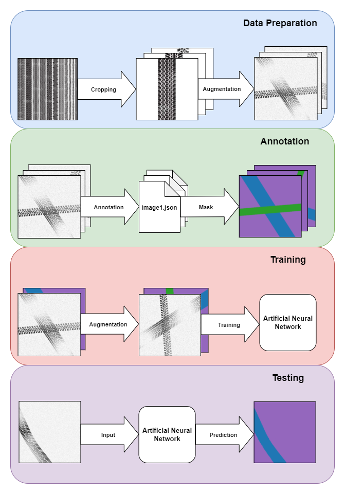

# Semantic-Segmentation-for-Tire-Tracks

Tire tracks are a type of track that has a very special place within the framework of criminalistic findings, but is not given the necessary importance in the world. So much so that in today's world, where artificial intelligence replaces human power in many issues, the evaluation of these findings is still made with human power. It is aimed to increase the success rate and reduce the cost in terms of time by using the semantic segmentation method, which is one of the modern approaches to this problem. By demonstrating the success of the approach through artificial data, strong evidence will be presented on the validity of the method.

* U-NET architecture used for training.
* 1100 images labelled with LabelMe annotation tool and splitted into 0.7/0.15/0.15.
* There are 10 tire track types, (7 annotated, 3 unannotated)
* PyTorch library used for training.
* Albumentation library used for data augmentation.

You can find the dataset from [here](https://www.kaggle.com/greysky/tire-track-images).
