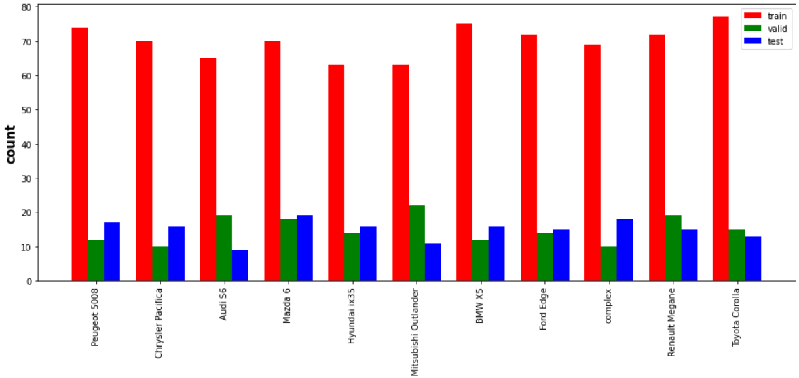
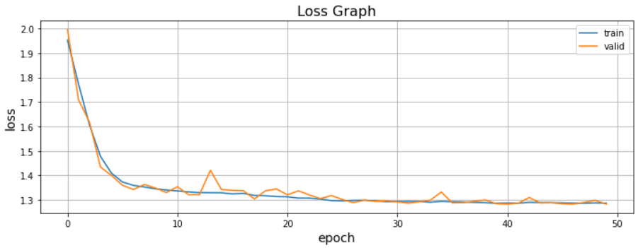
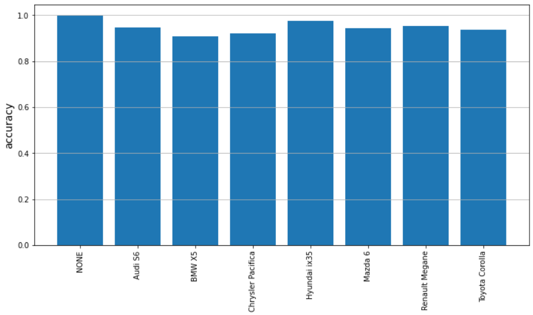
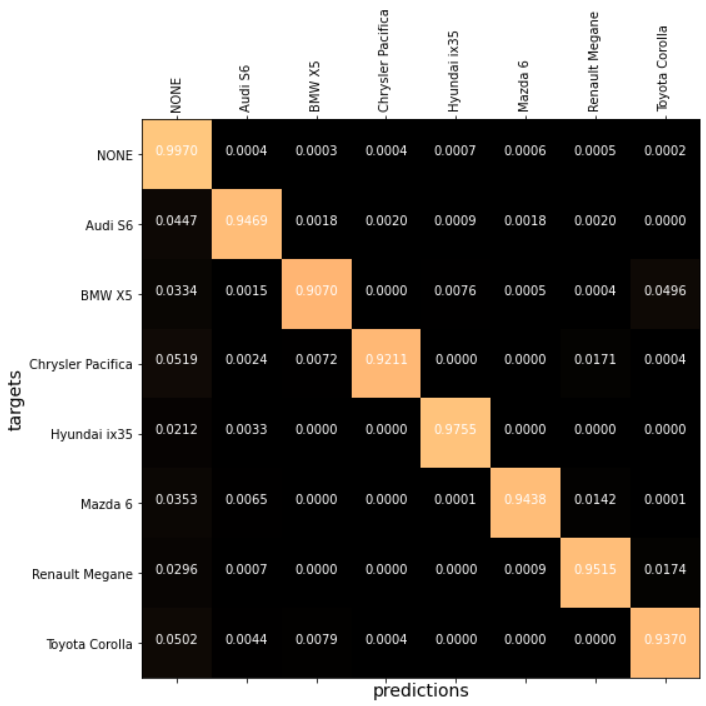

# Semantic-Segmentation-for-Tire-Tracks
It classifies tire tracks based on semantic segmentation method.

* The U-NET architecture used for training.
* 1100 images labelled with LabelMe annotation tool and splitted into 0.7/0.15/0.15.
* Albumentation library used for data augmentation.

## Dataset distribution

## Training

## Accuracy per class

## Confusion matrix

